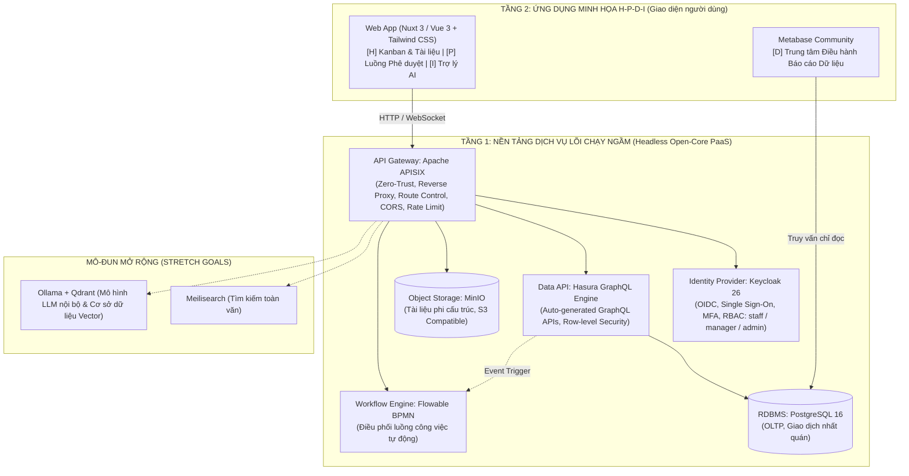

<!--
SPDX-FileCopyrightText: 2026 DX-Lab Project Hub contributors
SPDX-License-Identifier: Apache-2.0
-->

# KẾ HOẠCH TRIỂN KHAI DỰ ÁN DỰ THI OLP PHẦN MỀM NGUỒN MỞ 2026

**Kính gửi:** Thầy/Cô Cố vấn & Giảng viên Hướng dẫn Đội tuyển  
**Đơn vị:** Khoa Công nghệ Thông tin / Trường Đại học  
**Đề tài:** DX-Lab Project Hub – Hệ điều hành Doanh nghiệp số Lõi mở (DX-OS Open-Core)  
**Kho mã nguồn chính thức:** [https://github.com/ngophatneknha/OLP-M-Ngu-n-M-](https://github.com/ngophatneknha/OLP-M-Ngu-n-M-)  
**Trạng thái hệ thống:** Đã khởi tạo hạ tầng mã nguồn mở, tích hợp CI tự động kiểm định bản quyền đạt chuẩn REUSE Specification 3.3.

---

## 1. TỔNG QUAN CUỘC THI VÀ ĐỀ TÀI

### 1.1. Thông tin cuộc thi
- **Tên cuộc thi:** Olympic Tin học Sinh viên Việt Nam lần thứ 35 (OLP 2026) – Khối thi Phần mềm Nguồn mở (PMNM).
- **Cơ quan tổ chức:** Hội Tin học Việt Nam (VAIP) phối hợp cùng Câu lạc bộ Phần mềm Tự do Nguồn mở Việt Nam (VFOSSA).
- **Hình thức thi:** Hackathon lập trình theo đội tuyển kết hợp bảo vệ trực tiếp trước Hội đồng Giám khảo chuyên gia.
- **Quy mô đội thi:** Tối đa 03 sinh viên dưới sự dẫn dắt chuyên môn của 01 Giảng viên hướng dẫn.
- **Thời hạn then chốt:**
  - **Hạn nộp sản phẩm & đóng băng kho mã:** 17:00 ngày Chủ Nhật, 06/12/2026.
  - **Thời gian chấm mã nguồn (Vòng sơ khảo PoF):** Ngày 07/12 – 09/12/2026.
  - **Vòng chung kết & Trình diễn giải pháp:** Ngày 10/12/2026 (15 phút báo cáo & phản biện).

### 1.2. Đề tài & Mục tiêu giải pháp
Chủ đề năm 2026 do BTC công bố là **"Xây dựng Hệ điều hành Chuyển đổi số bằng Công nghệ Lõi nguồn mở (DX-OS Open-Core)"**.

Thực tế chuyển đổi số hiện nay tại đa số các tổ chức/doanh nghiệp thường gặp phải hai bẫy kỹ thuật:
1. **Phân mảnh ốc đảo dữ liệu:** Mua sắm nhiều phần mềm nhỏ lẻ, dữ liệu không thể trao đổi liền mạch.
2. **Khóa chặt nhà cung cấp (Vendor Lock-in):** Dùng các giải pháp nguyên khối (Monolithic) nguồn đóng, chi phí cao và mất chủ quyền số.

Đội tuyển chọn đề tài phát triển giải pháp **"DX-Lab Project Hub"** mô phỏng một trạm điều hành doanh nghiệp thực tế theo kiến trúc 3 tầng chuẩn của đề thi:
- **Tầng 1 (Nền tảng Lõi số Headless PaaS):** Vận hành hoàn toàn không giao diện người dùng, cung cấp các dịch vụ hạ tầng cốt lõi: Định danh tập trung (SSO/MFA), Cửa ngõ bảo mật (API Gateway), Quản trị dữ liệu (GraphQL & Object Storage), và Cỗ máy điều phối quy trình (Workflow Engine).
- **Tầng 2 (Không gian Năng lực số H-P-D-I):** Cung cấp ứng dụng minh họa hoàn chỉnh tích hợp mô hình tiến hóa quản trị:
  - **[H] Human (Con người số):** Cổng tác nghiệp, bảng điều phối Kanban công việc, kho lưu trữ tài liệu chuẩn P.A.R.A.
  - **[P] Process (Quy trình số):** Luồng số hóa đề xuất, kiểm soát rào chắn kỹ thuật (Poka-yoke) và cơ chế phê duyệt tự động.
  - **[D] Data (Dữ liệu số):** Trung tâm báo cáo thông minh thời gian thực (Dashboard BI), hợp nhất dữ liệu thực chứng.
  - **[I] Intelligence (Trí tuệ số - Mở rộng):** Trợ lý ảo tìm kiếm và truy xuất thông tin ngữ nghĩa (RAG) trên cơ sở tri thức nội bộ.

---

## 2. KIẾN TRÚC KỸ THUẬT & DANH MỤC CÔNG NGHỆ (THẨM ĐỊNH BẢN QUYỀN)

### 2.1. Sơ đồ kiến trúc tổng thể

### 2.2. Thẩm định Giấy phép Nguồn mở (Tuân thủ tiêu chuẩn OSI)
Một tiêu chí tiên quyết trong thang điểm OLP PMNM là **sản phẩm phải 100% sử dụng giấy phép được OSI công nhận (OSI-Approved)**. Đội tuyển đã thẩm định và chọn lọc khắt khe:

| Thành phần | Công nghệ lựa chọn | Giấy phép | Tình trạng thẩm định OSI | Lý do / Biện pháp an toàn |
|---|---|---|---|---|
| **Giấy phép toàn dự án** | Mã tự phát triển của đội | **Apache-2.0** | **Đạt chuẩn** | Tương thích cao, cho phép thương mại hóa và phát triển bền vững. |
| **Identity & SSO** | Keycloak | Apache-2.0 | **Đạt chuẩn** | Nền tảng SSO chuẩn doanh nghiệp hàng đầu thế giới. |
| **API Gateway** | Apache APISIX | Apache-2.0 | **Đạt chuẩn** | Hiệu năng cao, kiến trúc đám mây của Apache Software Foundation. |
| **Hệ quản trị CSDL** | PostgreSQL 16 | PostgreSQL License | **Đạt chuẩn** | Giấy phép tương tự MIT/BSD, hoàn toàn mở. |
| **Data Engine** | Hasura CE | Apache-2.0 (Core) | **Đạt chuẩn** | Khai thác bản Community thuần mã nguồn mở. |
| **Object Storage** | MinIO | AGPL-3.0 | **Đạt chuẩn** | Đóng gói container biệt lập qua network socket, không vi phạm liên kết mã nguồn. |
| **Workflow Engine** | Flowable BPMN | Apache-2.0 | **Đạt chuẩn** | *Thay thế n8n* vì n8n dùng license nguồn đóng/phi OSI (Sustainable Use License). |
| **Business Intelligence** | Metabase | AGPL-3.0 | **Đạt chuẩn** | Bản mã nguồn mở cộng đồng, chạy container riêng biệt. |
| **Giao diện người dùng** | Nuxt 3 / Vue 3 / Tailwind | MIT | **Đạt chuẩn** | Giấy phép tự do linh hoạt nhất hiện nay. |
| **Mở rộng AI (nếu kịp)** | Ollama & Qdrant | MIT / Apache-2.0 | **Đạt chuẩn** | Tự vận hành mô hình mở cục bộ, bảo vệ toàn vẹn dữ liệu bí mật. |

> **Cảnh báo công nghệ đã bị đội tuyển loại trừ để bảo toàn điểm số:** Loại trừ **n8n** (không đạt OSI), **Directus** (chuyển sang BSL), **Redpanda** (BSL) và **HashiCorp Vault bản mới** (BSL - nếu cần sẽ thay bằng OpenBao).

---

## 3. CHIẾN LƯỢC ĐẠT ĐIỂM TỐI ĐA THEO QUY CHẾ CHẤM THI

Quy chế OLP PMNM 2026 chia làm 2 phần chấm độc lập (mỗi phần 50 điểm, thang điểm 100):

### 3.1. Vòng chấm kho mã nguồn – Tiêu chí loại trừ PoF (50/50 Điểm)
Đây là phần thi chấm kín trên Internet trước ngày chung kết. Đội tuyển đã thiết lập quy trình kiểm soát chất lượng nghiêm ngặt:
1. **Quản lý mã nguồn trên Internet (5/5 điểm):** Kho mã đã mở **Public**, có web viewer đầy đủ tại GitHub. Lịch sử commit đều đặn hàng tuần từ cả 3 thành viên, tuyệt đối không dồn commit vào sát ngày thi.
2. **Cấp phép OSI-Approved (10/10 điểm):**
   - Đặt tệp toàn văn `LICENSE` (Apache-2.0).
   - Tích hợp công cụ **REUSE** của Hiệp hội Phần mềm Tự do Châu Âu (FSFE). Tự động chạy `reuse lint` trong CI workflow trên mọi lượt push/PR để đảm bảo 100% mọi tệp tin đều có bản quyền SPDX hợp lệ.
3. **Phát hành phiên bản chính thức (5/5 điểm):** Lập kế hoạch release định kỳ theo chuẩn SemVer (`v0.1.0` -> `v0.3.0` -> `v0.5.0` -> `v1.0.0`). Đóng gói định dạng chuẩn mở `.tar.gz`, tuyệt đối không dùng định dạng nguồn đóng `.zip`/`.rar` (tránh bị trừ 3 điểm).
4. **Cài đặt và biên dịch từ mã nguồn (10/10 điểm):**
   - Đóng gói toàn bộ nền tảng qua `docker-compose.yml` đạt chuẩn container hóa.
   - Cơ chế thiết lập bằng một lệnh duy nhất: `cp .env.example .env && docker compose up -d`.
   - Cấu hình qua biến môi trường động, không sửa thủ công vào tệp mã hoặc header.
5. **Quản lý thư viện và gói đính kèm (10/10 điểm):** Duy trì tài liệu `THIRD_PARTY.md` minh bạch tên thư viện, phiên bản và giấy phép; không can thiệp/chỉnh sửa mã nguồn của các gói đính kèm.
6. **Tài liệu và giao tiếp (10/10 điểm):** Duy trì `README.md`, `CHANGELOG.md` chuẩn Keep a Changelog, và hệ thống ghi nhận lỗi (`Bug Tracker`) hoạt động thực tế trên GitHub Issues.

### 3.2. Vòng chung kết – Trình diễn và bảo vệ giải pháp (50/50 Điểm)
- **Tính nguyên gốc của giải pháp (10đ):** Lắp ghép sáng tạo kiến trúc 3 tầng headless PaaS kết hợp công nghệ OLP các năm trước (GraphQL, BPMN, BI, RAG).
- **Mức độ hoàn thiện (10đ):** Luồng demo 1 kịch bản duy nhất chạy thực tế trơn tru, không dừng gián đoạn.
- **Mức độ thân thiện (10đ):** Giao diện tiếng Việt chuẩn hóa, trực quan, có gắn nhãn rõ ràng các phân tầng [H], [P], [D], [I].
- **Mức độ phát triển bền vững (10đ):** Hồ sơ kiến trúc, runbook vận hành, chỉ dẫn đóng góp (`CONTRIBUTING.md`) và tài liệu API.
- **Phong cách trình diễn (10đ):** Phân vai thuyết trình 15 phút chuyên nghiệp, luôn chuẩn bị 01 video quay sẵn và 01 môi trường offline chạy trên máy trạm dự phòng trường hợp mất mạng.

---

## 4. PHÂN CÔNG NHÂN SỰ & MA TRẬN TRÁCH NHIỆM (RACI)

Đội tuyển gồm 03 sinh viên được phân nhiệm vụ cụ thể dựa trên sở trường chuyên môn, có cơ chế dự phòng chéo:

### 4.1. Bảng phân nhiệm thành viên

| Thành viên | Chức danh trong dự án | Trách nhiệm kỹ thuật chính | Phụ trách điểm PoF | Dự phòng chuyên môn |
|---|---|---|---|---|
| **Sinh viên A** | **Trưởng nhóm Kỹ thuật & Hạ tầng (Platform & Security Lead)** | - Xây dựng nền tảng Lõi Tầng 1 (Keycloak, APISIX Gateway, Docker Compose). - Thiết lập bảo mật Zero-Trust, phân quyền RBAC/OIDC. - Thiết lập GitHub Actions CI/CD và quy trình Build from source. | **Chịu trách nhiệm PoF mục 4 & 1** (Cài đặt biên dịch mã nguồn, Đóng gói Docker, Lịch sử Git). | Dự phòng cho Sinh viên B (Hỗ trợ cấu hình CSDL và Event Trigger). |
| **Sinh viên B** | **Kỹ sư Dữ liệu & Quy trình (Data & Workflow Engineer)** | - Thiết kế mô hình dữ liệu PostgreSQL, tối ưu GraphQL API (Hasura). - Tích hợp lưu trữ MinIO và quy trình phê duyệt tự động Flowable BPMN. - Xây dựng báo cáo Metabase Dashboard [D] và mô-đun AI RAG [I]. | **Chịu trách nhiệm PoF mục 5** (Quản lý thư viện, Giấy phép bên thứ ba `THIRD_PARTY.md`, không sửa mã đính kèm). | Dự phòng cho Sinh viên C (Hỗ trợ xử lý API Frontend và test tích hợp). |
| **Sinh viên C** | **Quản trị Sản phẩm & Tài liệu (Product, Frontend & Docs Lead)** | - Xây dựng ứng dụng Web minh họa Tầng 2 (Nuxt 3 / Vue 3 + Tailwind CSS). - Thiết kế trải nghiệm người dùng (UX) cho các không gian H-P-D-I. - Quản lý tài liệu kỹ thuật, slide báo cáo, điều phối tiến độ Kanban. | **Chịu trách nhiệm PoF mục 2, 3 & 6** (Kiểm định REUSE bản quyền từng file, Soạn Changelog, Release SemVer, Bug Tracker). | Dự phòng cho Sinh viên A (Hỗ trợ kiểm thử build trên môi trường máy sạch). |
| **Thầy/Cô GVHD** | **Giảng viên Cố vấn & Hướng dẫn (Project Advisor)** | - Định hướng nghiệp vụ và tính khả thi bài toán quản trị số. - Chủ trì đánh giá Gate Review định kỳ 2 tuần/lần. - Đại diện Nhà trường bảo trợ pháp lý và xác nhận thủ tục đăng ký thi. | **Giám sát toàn diện chất lượng học thuật và quy chế thi.** | – |

### 4.2. Ma trận trách nhiệm (RACI)

| Gói công việc | Sinh viên A | Sinh viên B | Sinh viên C | Giảng viên hướng dẫn |
|---|:---:|:---:|:---:|:---:|
| 1. Khảo sát & Chốt kiến trúc công nghệ lõi mở | **A / R** | R | C | **C / I** |
| 2. Thiết lập hạ tầng Lõi Tầng 1 (SSO, Gateway, PaaS) | **A / R** | C | I | I |
| 3. Xây dựng dịch vụ Dữ liệu (Postgres, Hasura, MinIO) | C | **A / R** | I | I |
| 4. Thiết lập luồng tự động hóa quy trình (Flowable) | C | **A / R** | C | I |
| 5. Phát triển ứng dụng Web minh họa H-P-D-I | I | C | **A / R** | I |
| 6. Xây dựng trung tâm điều hành dữ liệu Metabase | I | **A / R** | C | I |
| 7. Kiểm định giấy phép REUSE & Tuân thủ PoF | C | R | **A / R** | **C** |
| 8. Đóng gói Container & Kiểm thử Build sạch | **A / R** | C | C | I |
| 9. Báo cáo định kỳ (Gate Review mỗi 2 tuần) | R | R | **A / R** | **A (Chủ trì)** |
| 10. Hoàn thiện Slide, Video & Diễn tập thuyết trình | C | C | **A / R** | **A (Duyệt)** |
| 11. Thủ tục nộp bài thi chính thức gửi BTC | R | R | **A** | **A (Phê duyệt)** |

*(Ghi chú: **A** - Accountable: Chịu trách nhiệm cuối cùng; **R** - Responsible: Người trực tiếp thực hiện; **C** - Consulted: Tham vấn ý kiến; **I** - Informed: Nhận thông tin báo cáo)*

---

## 5. LỘ TRÌNH THỰC HIỆN CHI TIẾT (WBS THEO TUẦN)

Kế hoạch chia làm 9 chặng (Sprint) từ tuần 0 đến ngày thi chung kết:

| Giai đoạn | Thời gian | Nhiệm vụ trọng tâm | Sản phẩm đầu ra (Deliverables) | Điểm kiểm soát (Gate Review) |
|---|---|---|---|---|
| **Tuần 0** | 09/10 – 18/10 | - Khởi tạo repo, CI/CD, chuẩn hóa giấy phép REUSE (đã hoàn thành). - Khảo sát công nghệ, thiết kế lược đồ CSDL. - Đăng ký đội tuyển với Khoa/Trường. | - Repo GitHub Public 100% xanh CI. - Backlog chi tiết 85 issues. - Lược đồ CSDL nháp. | **Gate 0:** Thống nhất danh mục công nghệ & phân vai. |
| **Tuần 1** | 19/10 – 25/10 | - Cấu hình cụm Keycloak (Realm `dxlab`, 3 role chuẩn). - Kết nối Hasura với PostgreSQL, tạo API tự động. - Dựng khung ứng dụng Nuxt 3 frontend. | - Đăng nhập SSO OIDC thành công. - Hasura sinh GraphQL API từ PostgreSQL. | Họp đội cuối tuần, kiểm tra SSO end-to-end. |
| **Tuần 2** | 26/10 – 01/11 | - Cấu hình APISIX Gateway: route, JWT auth, CORS, Rate Limit. - Tích hợp MinIO lưu trữ tài liệu. - Xây dựng bảng Kanban công việc [H]. | - **Bản phát hành Release v0.1.0** (.tar.gz). - Hướng dẫn cài đặt build sạch bước đầu. | **Gate 1 (với GVHD):** Demo Tầng 1 Lõi hoạt động qua Gateway. |
| **Tuần 3** | 02/11 – 08/11 | - Triển khai Flowable BPMN vào compose. - Thiết lập Hasura Event Trigger kích hoạt tiến trình phê duyệt. - Màn hình gửi yêu cầu & duyệt yêu cầu [P]. | - Luồng phê duyệt tự động chạy thông suốt qua API. | Kiểm tra tính bảo mật phân quyền duyệt yêu cầu. |
| **Tuần 4** | 09/11 – 15/11 | - **Đối chiếu đề thi chính thức** do BTC công bố trong tháng 11. - Tích hợp Metabase, dựng dashboard [D] theo dõi KPI/tiến độ. - Nhúng dashboard bảo mật vào Nuxt 3. | - **Bản phát hành Release v0.3.0**. - Hệ thống hoàn chỉnh 3 không gian H-P-D. | **Gate 2 (với GVHD):** Đối chiếu đề thi chính thức, cập nhật backlog. |
| **Tuần 5** | 16/11 – 22/11 | - Đánh giá hiệu năng và tài nguyên máy tính. - Quyết định kích hoạt mô-đun mở rộng AI [I] (Ollama/Qdrant) hoặc tinh giản để ưu tiên độ ổn định. - Tối ưu hóa trải nghiệm người dùng (UX mobile/web). | - **Bản phát hành Release v0.5.0**. - Hệ thống hỗ trợ đa thiết bị. | Họp đội chốt phạm vi tính năng (Scope Cutoff). |
| **Tuần 6** | 23/11 – 29/11 | - Soạn thảo tài liệu người dùng, runbook vận hành, sơ đồ kiến trúc. - Kiểm thử tải và rà soát bảo mật. - **ĐÓNG BĂNG TÍNH NĂNG (FEATURE FREEZE 29/11)**. | - Bộ tài liệu kỹ thuật hoàn chỉnh. - Mã nguồn ổn định tuyệt đối. | **Gate 3 (với GVHD):** Rà soát toàn diện danh mục tiêu chí PoF. |
| **Tuần 7** | 30/11 – 06/12 | - Thử nghiệm build sạch trên máy tính trắng độc lập (mô phỏng máy chấm của BTC). - Đóng gói bản phát hành chính thức **v1.0.0** (.tar.gz). - Soạn slide báo cáo, quay video demo dự phòng. - **GỬI EMAIL NỘP BÀI THI CHÍNH THỨC TRƯỚC 17:00 06/12**. | - Release v1.0.0 kèm Changelog. - Email xác nhận gửi bài thi. - Slide báo cáo 15 phút. | **Gate 4 (Duyệt nộp bài):** GVHD kiểm tra email và ký xác nhận nộp bài. |
| **Tuần 8** | 07/12 – 10/12 | - Vòng chấm mã nguồn kín (07-09/12). - Diễn tập thuyết trình 15 phút tối thiểu 03 lần. - Chuẩn bị kịch bản phản biện kỹ thuật. - **THI CHUNG KẾT TẠI HỘI TRƯỜNG (10/12)**. | - Showcase sản phẩm chạy trực tiếp. - Bài thuyết trình tự tin, chuẩn xác. | Tham gia tranh tài tại buổi Chung kết OLP 2026. |

---

## 6. PHÂN TÍCH RỦI RO & PHƯƠNG ÁN DỰ PHÒNG

| Rủi ro tiềm ẩn | Mức độ | Hậu quả | Biện pháp phòng ngừa & Kịch bản xử lý |
|---|:---:|---|---|
| **1. Đề thi chính thức (tháng 11) có yêu cầu thay đổi** | Cao | Lệch hướng phát triển nếu ôm đồm tính năng cứng. | **Biện pháp:** Thiết kế hệ thống theo mô hình Microservices cắm-rút (Plug & Play). Dành trọn Tuần 4 để rà soát đề chính thức và điều chỉnh backlog. |
| **2. Vi phạm bản quyền nguồn mở (PoF)** | Nghiêm trọng | Bị trừ 5 - 10 điểm, nguy cơ mất giải. | **Biện pháp:** Tích hợp kiểm định tự động REUSE trong CI (đã hoạt động). Lập danh mục `THIRD_PARTY.md` và nhờ GVHD duyệt trước khi nộp. |
| **3. Quá tải tài nguyên máy tính (RAM/CPU)** | Trung bình | Máy tính giật lag khi chạy nhiều container cùng lúc. | **Biện pháp:** Tách Docker Profile (`--profile ai`). Các dịch vụ lõi tiêu chuẩn chạy nhẹ dưới 6GB RAM; chỉ bật AI khi máy đủ cấu hình. |
| **4. Sự cố mạng hoặc lỗi kỹ thuật lúc Demo trực tiếp** | Cao | Mất điểm hoàn thiện và phong cách trình diễn. | **Biện pháp:** Chuẩn bị 3 lớp bảo vệ: (1) Bản demo trực tuyến có domain/TLS; (2) Bản local chạy độc lập trên máy trạm mang theo; (3) Video demo chất lượng cao quay sẵn dự phòng tình huống xấu nhất. |
| **5. Thành viên gặp sự cố cá nhân / lịch thi học phần** | Trung bình | Tiến độ task bị đình trệ. | **Biện pháp:** Áp dụng ma trận dự phòng chéo (A↔B↔C) và văn hóa tài liệu hóa rõ ràng trong từng Issue. |

---

## 7. ĐỀ XUẤT HỖ TRỢ TỪ GIẢNG VIÊN HƯỚNG DẪN & NHÀ TRƯỜNG

Để tạo điều kiện tốt nhất cho đội tuyển đạt giải cao tại OLP 2026, đội tuyển kính đề xuất Thầy/Cô và Nhà trường hỗ trợ:

1. **Thủ tục hành chính:** Ban hành quyết định thành lập đội tuyển và gửi văn bản đăng ký dự thi chính thức tới Ban Tổ chức OLP 2026 đúng thời hạn quy định.
2. **Cơ sở hạ tầng thực nghiệm:** Hỗ trợ mượn 01 máy chủ ảo (VPS Cloud) cấu hình trung bình (4 Core / 8GB RAM) trong vòng 2 tháng (10/10 - 15/12) để nhóm triển khai môi trường thử nghiệm công khai trên Internet (giúp đạt tối đa điểm tiêu chí chấm chung kết).
3. **Sinh hoạt học thuật định kỳ:** Dành thời gian tham gia các buổi **Gate Review 2 tuần/lần (thời lượng 30 - 45 phút)** nhằm nghe sinh viên demo tiến độ, góp ý tính khả thi và định hướng giải pháp phản biện kỹ thuật.

---

*Kế hoạch này đã được thông qua bởi toàn thể 03 thành viên đội tuyển và chính thức lưu trữ tại kho mã nguồn dự án để theo dõi tiến độ công khai.*

**ĐẠI DIỆN ĐỘI TUYỂN DỰ THI OLP PMNM 2026**  
*(Ký và ghi rõ họ tên)*
