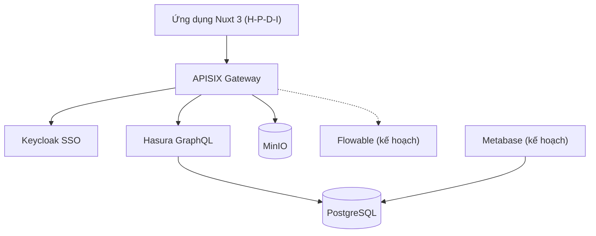

<!--
SPDX-FileCopyrightText: 2026 DX-Lab Project Hub contributors
SPDX-License-Identifier: Apache-2.0
-->

# Kiến trúc

Nguyên tắc: tầng lõi **headless** – chỉ cung cấp dịch vụ qua API; mọi giao diện nằm ở tầng ứng dụng.
Kế hoạch chi tiết và các quyết định công nghệ sẽ được cập nhật tại đây.
